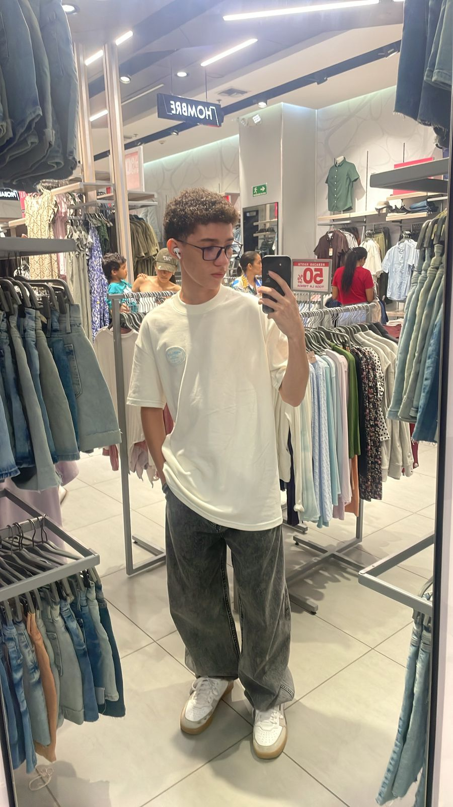

# Proyecto Laravel – Marcos Pro

## 📌 Información del Estudiante
- **Nombre:** Marcos Marcos Valera Daza  
- **ID Universitario:** U00177223  
- **IMG del futuro profecional:** 
  

---

## 📖 Descripción del Proyecto
Este proyecto fue desarrollado utilizando el framework **Laravel** como parte de un trabajo académico.  
El objetivo del proyecto es aplicar los conceptos fundamentales del desarrollo web backend, siguiendo buenas prácticas de estructura, organización y diseño.

La aplicación cuenta con una página de inicio personalizada donde se muestra la identidad del estudiante.

---

## 🛠️ Tecnologías Utilizadas
- **Laravel**
- **PHP**
- **Blade**
- **Tailwind CSS**
- **HTML5**
- **CSS3**

---

## 🚀 Instalación y Ejecución

1. Clonar el repositorio:
   ```bash
   git clone https://github.com/MarcozVD/proyecto-de-clase.git